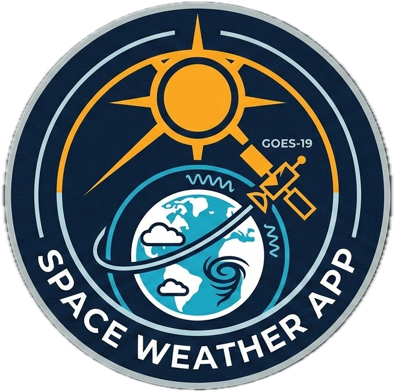

<div align="center">
  

  # GOES-19 Space Weather Monitor

  **Monitor de clima espacial en tiempo real con datos de GOES-19, NOAA/SWPC y prediccion IA**

  [](https://nextjs.org/)
  [](https://typescriptlang.org/)
  [](https://python.org/)
  [](LICENSE)

</div>

---

## Que es esta aplicacion

GOES-19 Space Weather Monitor es un dashboard web completo para monitoreo de clima espacial en tiempo real. Consume datos del satelite GOES-19 (Geostationary Operational Environmental Satellite) y del NOAA Space Weather Prediction Center (SWPC) para mostrar:

- **Imagenes ABI en tiempo real** — 16 bandas espectrales del satelite GOES-19
- **Magnetometro** — campo magnetico Hp, He, Hn del entorno satelital
- **Flujo de rayos X** — actividad de llamaradas solares (clases A, B, C, M, X)
- **Flujo de electrones y protones** — radiacion de particulas energeticas
- **Indice Kp** — nivel de perturbacion geomagnetica global
- **Aurora boreal/austral** — modelo OVATION de prediccion de auroras
- **Viento solar** — modelo WSA-ENLIL y datos DSCOVR en tiempo real
- **Coronografo** — imagenes CME (eyecciones de masa coronal)
- **Escalas NOAA** — niveles G (geomagnetico), R (radio), S (solar) en tiempo real
- **Prediccion LSTM** — forecasting del Kp para +1h, +3h y +6h con red neuronal
- **Alertas espaciales** — notificaciones push de tormentas geomagneticas

La aplicacion esta disenada para investigadores, aficionados a la astronomia, operadores de comunicaciones de radio y cualquier persona interesada en el clima espacial.

---

## Tabla de contenidos

- [Caracteristicas](#caracteristicas)
- [Requisitos](#requisitos)
- [Instalacion](#instalacion)
- [Variables de entorno](#variables-de-entorno)
- [Arquitectura](#arquitectura)
- [Fuentes de datos](#fuentes-de-datos)
- [Prediccion con IA (LSTM)](#prediccion-con-ia-lstm)
- [Testing](#testing)
- [Deployment](#deployment)
- [Documentacion extendida](#documentacion-extendida)

---

## Caracteristicas

| Modulo | Descripcion |
|--------|-------------|
| Dashboard principal | Resumen de escalas NOAA, Kp actual, alertas activas |
| Imagenes ABI | Animacion de 16 bandas + productos RGB en tiempo real |
| Magnetometro | Grafico interactivo Hp/He/Hn, rangos 1h-7d |
| Rayos X | Flujo solar con anotaciones de clase de llamarada |
| Flujo de particulas | Electrones >2MeV, >4MeV y protones >10..>500 MeV |
| Indice Kp | Barras de actividad geomagnetica por hora |
| Aurora 3D | Globo interactivo con probabilidad de aurora por latitud |
| Viento solar | Animacion del modelo WSA-ENLIL |
| Coronografo LASCO | Eyecciones de masa coronal (LASCO C2/C3, STEREO) |
| SUVI | Imagenes ultravioleta solar en 5 longitudes de onda |
| Prediccion Kp | LSTM +1h/+3h/+6h con fallback basado en reglas |
| Ciclo solar | Progresion del ciclo solar 25 con prediccion NOAA |
| Clima espacial | Articulos educativos sobre fenomenos solares |
| Alertas push | Notificaciones Web Push para tormentas G2+ |
| Mapa aurora | Mapa interactivo con franjas aurorales en tiempo real |
| Sismos INPRES | Monitor de actividad sismica (Argentina) |
| Estado satelites | Tabla de estado operacional de la constelacion GOES |

---

## Requisitos

### Frontend

| Herramienta | Version minima |
|-------------|----------------|
| Node.js | 20 LTS |
| pnpm | 9+ |
| Git | cualquiera |

### Servicio de prediccion IA (opcional)

| Herramienta | Version minima |
|-------------|----------------|
| Python | 3.11+ |
| pip | cualquiera |
| Docker | 20+ (para deployment) |

> El servicio de prediccion es **opcional**. Si no se configura, el dashboard usa un modelo basado en reglas automaticamente.

---

## Instalacion

### 1. Clonar el repositorio

```bash
git clone https://github.com/francovaco/space-weather-app.git
cd space-weather-app
```

### 2. Instalar dependencias Node

```bash
pnpm install
```

### 3. Configurar variables de entorno

```bash
cp .env.local.example .env.local
```

La mayoria de los valores ya estan pre-cargados en el ejemplo. El unico cambio recomendado para desarrollo local es agregar tu NASA API Key (opcional — sin ella usa DEMO_KEY con limite de 30 req/hora).

Ver [docs/ENV.md](docs/ENV.md) para referencia completa de todas las variables.

### 4. Iniciar el servidor de desarrollo

```bash
pnpm dev
```

Abrir [http://localhost:3000](http://localhost:3000).

---

## Comandos disponibles

```bash
pnpm dev          # Servidor de desarrollo en http://localhost:3000
pnpm build        # Build de produccion
pnpm start        # Servidor de produccion (requiere pnpm build primero)
pnpm lint         # ESLint
pnpm type-check   # TypeScript sin compilar (tsc --noEmit)
pnpm format       # Prettier sobre src/**/*.{ts,tsx,js,jsx,json,css}

# Tests E2E
pnpm test:e2e           # Playwright headless
pnpm test:e2e:ui        # Playwright con interfaz grafica
pnpm test:e2e:headed    # Playwright con ventana de browser visible
pnpm test:e2e:report    # Abrir reporte HTML del ultimo run
```

---

## Variables de entorno

Las variables criticas son:

```bash
# Requeridas (pre-configuradas en .env.local.example)
NEXT_PUBLIC_SWPC_SERVICES="https://services.swpc.noaa.gov"
NEXT_PUBLIC_GOES19_CDN="https://cdn.star.nesdis.noaa.gov/GOES19/ABI"

# Opcionales pero recomendadas
NASA_API_KEY="tu-key"              # api.nasa.gov — gratuita
FORECAST_SERVICE_URL="https://..."  # URL del microservicio Python

# Para notificaciones push
NEXT_PUBLIC_VAPID_PUBLIC_KEY="..."
VAPID_PRIVATE_KEY="..."
VAPID_EMAIL="tu@email.com"
```

Ver [docs/ENV.md](docs/ENV.md) para la referencia completa.

---

## Arquitectura

```
NOAA/SWPC/GOES-19 APIs
  ↓
Next.js API routes (src/app/api/)     ← proxy CORS + cache 60s
  ↓
TanStack Query (useAutoRefresh hook)  ← polling automatico por instrumento
  ↓
Zustand stores                        ← estado UI persistido en localStorage
  ↓
Componentes React + Plotly/Canvas/Three.js
```

El flujo de datos es **unidireccional**: el cliente nunca llama a NOAA directamente — todo pasa por las API routes del servidor Next.js, que actuan como proxy con cache y headers CORS correctos.

Ver [docs/ARCHITECTURE.md](docs/ARCHITECTURE.md) para la descripcion completa.

---

## Fuentes de datos

| Producto | Fuente | Intervalo de refresh |
|----------|--------|---------------------|
| ABI imagery (16 bandas) | cdn.star.nesdis.noaa.gov | 10 min |
| Magnetometro (Hp/He/Hn) | services.swpc.noaa.gov | 1 min |
| Rayos X (A-X class) | services.swpc.noaa.gov | 1 min |
| Viento solar plasma | services.swpc.noaa.gov | 1 min |
| Kp Index | services.swpc.noaa.gov | 1 min |
| Flujo de electrones | services.swpc.noaa.gov | 5 min |
| Flujo de protones | services.swpc.noaa.gov | 5 min |
| Aurora OVATION | services.swpc.noaa.gov | 5 min |
| SUVI UV solar | services.swpc.noaa.gov | 5 min |
| Coronografo CME | services.swpc.noaa.gov | 10 min |
| Modelo WSA-ENLIL | www.swpc.noaa.gov | 10 min |
| Estado satelites GOES | www.ospo.noaa.gov | 5 min |
| Alertas NOAA | services.swpc.noaa.gov | 1 min |
| NASA DONKI (CME) | api.nasa.gov | bajo demanda |
| Precipitacion NASA POWER | power.larc.nasa.gov | bajo demanda |
| Meteorologia Open-Meteo | api.open-meteo.com | bajo demanda |
| Sismos INPRES | datasource.inpres.gob.ar | 5 min |

---

## Prediccion con IA (LSTM)

El sistema incluye un microservicio Python con una red neuronal LSTM entrenada para predecir el indice Kp a +1h, +3h y +6h.

### Como funciona

1. El microservicio descarga datos en tiempo real de NOAA (Bz, velocidad del viento solar, Kp actual)
2. Construye una secuencia de 24 pasos temporales
3. La pasa por el modelo LSTM exportado a ONNX
4. Devuelve las predicciones via `/predict`

### Iniciar el servicio localmente

```bash
cd forecast-service
python -m venv venv
source venv/bin/activate    # Windows: venv\Scripts\activate
pip install -r requirements.txt

# Si ya hay un modelo entrenado en weights/kp_lstm.onnx:
uvicorn main:app --reload --port 8000
```

El servicio queda disponible en [http://localhost:8000](http://localhost:8000).

Agregar en `.env.local`:
```bash
FORECAST_SERVICE_URL="http://localhost:8000"
```

### Entrenar el modelo

```bash
cd forecast-service
pip install -r requirements-train.txt

# Entrenamiento con defaults (50 epocas, 2 anos de datos historicos)
python train.py

# Parametros avanzados
python train.py --epochs 100 --lr 5e-4 --seq-len 24 --hidden 128 --kp-years 3
```

El script descarga automaticamente datos historicos de GFZ Potsdam (Kp) y NOAA DSCOVR, entrena la red, y exporta el modelo a `weights/kp_lstm.onnx` listo para produccion.

Ver [docs/LSTM.md](docs/LSTM.md) para la explicacion completa del modelo y guia de entrenamiento.

---

## Testing

Los tests E2E usan **Playwright** con mocks de las APIs externas.

```bash
# Correr todos los tests
pnpm test:e2e

# Con UI interactiva
pnpm test:e2e:ui
```

Los tests cubren:
- Navegacion entre paginas
- Endpoints API (estructura de respuesta)
- Visualizacion de instrumentos con datos mockeados
- Layout responsive (desktop + mobile Pixel 5)
- Metricas internas

Ver [docs/TESTING.md](docs/TESTING.md) para la guia completa de testing.

---

## Deployment

### Frontend — Vercel (recomendado)

```bash
# Instalar Vercel CLI
npm i -g vercel

# Deploy
vercel
```

Configurar las variables de entorno en el panel de Vercel.

### Servicio Python — Railway (recomendado)

```bash
# Desde forecast-service/
railway up
```

El Dockerfile usa `python:3.13-slim` con solo ONNX Runtime (~400 MB vs ~2 GB con PyTorch completo).

Ver [docs/DEPLOYMENT.md](docs/DEPLOYMENT.md) para la guia completa de deployment.

---

## Documentacion extendida

| Documento | Descripcion |
|-----------|-------------|
| [docs/ARCHITECTURE.md](docs/ARCHITECTURE.md) | Arquitectura detallada, patrones, flujo de datos |
| [docs/LSTM.md](docs/LSTM.md) | Que es LSTM, como funciona el modelo, guia de entrenamiento |
| [docs/TESTING.md](docs/TESTING.md) | Guia completa de tests E2E con Playwright |
| [docs/DEPLOYMENT.md](docs/DEPLOYMENT.md) | Deploy en Vercel + Railway, Docker, CI/CD |
| [docs/ENV.md](docs/ENV.md) | Referencia de todas las variables de entorno |

---

## Stack tecnologico completo

### Frontend
- **Next.js 14** (App Router) + **TypeScript 5.5**
- **React 18** con Suspense y Server Components
- **TanStack Query v5** — data fetching y polling automatico
- **Zustand v4** — estado UI persistido en localStorage
- **Tailwind CSS v3** — sistema de diseno dark space theme
- **Plotly.js** — graficos interactivos con tema oscuro
- **Three.js** — globo 3D de auroras y magnetosfera
- **MapLibre GL** — mapas interactivos aurora/alertas
- **Framer Motion** — animaciones fluidas
- **Radix UI** — componentes accesibles sin estilos

### Backend / Infraestructura
- **Next.js API Routes** — proxy CORS y cache de todas las APIs externas
- **Sentry** — monitoreo de errores cliente y servidor
- **Web Push (VAPID)** — notificaciones push nativas
- **PWA** — service worker, instalable como app nativa

### Servicio IA
- **FastAPI** — microservicio REST
- **PyTorch** — entrenamiento del modelo LSTM
- **ONNX Runtime** — inferencia liviana en produccion (sin PyTorch)
- **Docker** — contenedor ~400 MB para Railway/Cloud Run

### Testing
- **Playwright** — tests E2E multi-browser

---

## Estructura del proyecto

```
space-weather-app/
├── src/
│   ├── app/
│   │   ├── (dashboard)/         # Todas las paginas del dashboard
│   │   ├── api/                 # 42 API routes (proxies CORS)
│   │   │   ├── swpc/            # 22 endpoints NOAA/SWPC
│   │   │   ├── goes/            # 4 endpoints GOES-19
│   │   │   ├── forecast/        # 2 endpoints prediccion
│   │   │   ├── nasa/            # DONKI + precipitacion
│   │   │   ├── push/            # Web Push notifications
│   │   │   └── ...
│   │   └── layout.tsx
│   ├── components/              # 52 componentes React
│   │   ├── instruments/         # 22 clientes de instrumentos
│   │   ├── layout/              # AppShell, TopBar, SpaceWeatherBar
│   │   ├── forecast/            # ForecastDashboard
│   │   └── ...
│   ├── hooks/                   # useAutoRefresh, useClocks, useAnimationPlayer
│   ├── lib/                     # swpc-api, goes-imagery, logger, metrics
│   ├── stores/                  # Zustand: ui, animation, notifications
│   └── types/                   # TypeScript: swpc, goes, forecast, ui
├── forecast-service/            # Microservicio Python FastAPI + LSTM
│   ├── main.py                  # FastAPI app
│   ├── model.py                 # Arquitectura LSTM (PyTorch)
│   ├── predictor.py             # Inferencia ONNX + fallback
│   ├── train.py                 # Script de entrenamiento
│   ├── weights/                 # kp_lstm.onnx + norms.json
│   └── Dockerfile
├── tests/
│   └── e2e/                     # Tests Playwright
│       ├── api.spec.ts
│       ├── navigation.spec.ts
│       ├── instruments.spec.ts
│       ├── layout.spec.ts
│       └── metrics.spec.ts
├── public/assets/               # Logo y assets estaticos
├── .env.local.example           # Template de variables de entorno
├── next.config.mjs
├── tailwind.config.ts
└── playwright.config.ts
```

---

## Contribuir

El proyecto sigue el patron **module-per-instrument**. Para agregar un nuevo instrumento:

1. Agregar tipos en `src/types/swpc.ts`
2. Crear API proxy en `src/app/api/swpc/[instrumento]/route.ts`
3. Crear componente cliente en `src/components/instruments/[Instrumento]Client.tsx`
4. Crear pagina en `src/app/(dashboard)/instruments/[instrumento]/page.tsx`
5. Agregar al sidebar en `src/components/navigation/Sidebar.tsx`

Ver [docs/ARCHITECTURE.md](docs/ARCHITECTURE.md) para el patron completo con ejemplos.

---

<div align="center">
  <sub>Datos provistos por NOAA/SWPC · GOES-19 · NASA · GFZ Potsdam</sub>
</div>
